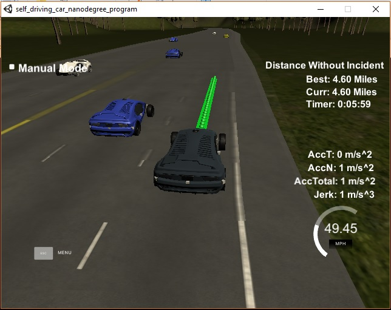
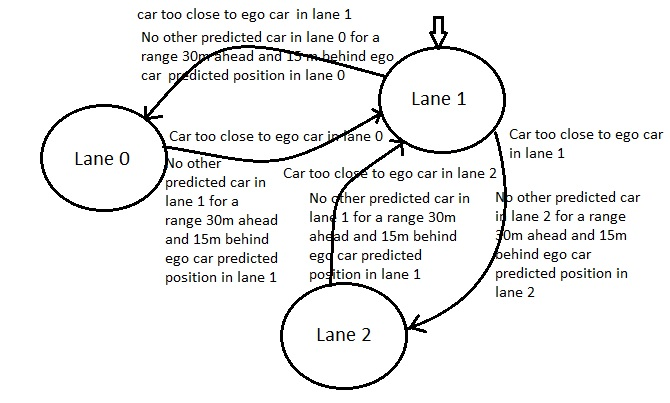
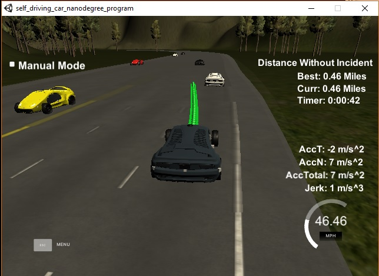

## Path Planning Project

### Output 

    Final output after driving through highway (4.6 Miles)
    

### Rubric Points

   **The Code compiles correctly : ** The code is compiled successfully. 
   We have used Spline function for trajectory generation instead of polynomial fitting to generate smooth path.
   Spline.h header file is being used to get spline functionality.
   
   **The car is able to drive at least 4.32 miles without incident : ** The car is able to drive itself very smoothly.
   We have tested for 10.5 miles of highway.
   
   **The car drives according to the speed limit : ** The car drives for 10.5 miles of stretch without exceeding speed limit of 49.5 MPH. 
   Speed of car decreases as soon as it finds another car in range of 30m.
   
   **Max Acceleration and Jerk are not Exceeded : ** No incident has been reported for sudden increase in acceleration or jerk.
   
   **Car does not have collisions : ** No collision is reported while driving on highway upto 10.5 miles.
   
   **The car stays in its lane, except for the time between changing lanes : ** The car always stays in lane unless a free lane is available where the car can go with speed higher or equal to the current lane.
   
   **The car is able to change lanes : ** The car is able to change lanes very smoothly if other car in same is available in range of 30m and there is going to be no cars predicted in the lane we are planning to move into.
   
   
### Model Documentation

   The simulator sends various parameters like *Car's location, velocity, yaw rate, speed, frenet coordinates and sensor fusion data*(for other cars in all the lanes).*Spline.h* library is being used for fitting polynomials as it is going to give smoother trajectory points.

#### Prediction
    
   As we recieved *Car's location, yaw rate, frenet coordinates, sensor fusion, velocity and speed* from the simulator.
So by using these parameters we are predicting the future position trajectory of nearby vehicle and based on their future we are going to take the decision for our own car. 

#### Behaviour Planning
    
   Behaviour of our car is implemented in following steps:
    1. Check for vehicles(too close) in current lane.
    2. If ego cars finds vehicles too close(30m) in current lane.
    3. Planner checks for availablity of free lane such that any car's future position in destination lane is 15m behind and 30m ahead of ego car's predicted position after lane change.
    4. If no car been detected in destination lane ,lane change maneuver is performed. 
    5. If there is a car present in destination lane then speed been reduced to avoid collision.
    
#### Trajectory Generation
    
We have taken 50 trajectory points to define the trajectory.*car speed, the speed of surrounding cars, current lane, intended lane and previous points* is being used for trajectory point calculation.To make the trajectory smooth we have used last 2 points from previous point list. If the list is empty we have taken two points based on car's position and heading.
Post these 2 points calculation, 3 more way points (30m,60m and 90m apart) is added to the list.Then we have generated remaining points 0.02 sec apart.To make calculation easier we transformed the points to car's co ordinate system. Points is transformed to global co ordinate system before sending it to simulator.
#### Finite State Machine (Lane Change)
    
Since there are 3 lanes so we have 3 states.By assuming lane 1 as start state below is the diagram for finite state machine implemented in the project:

Snap taken from video while changing the lane

